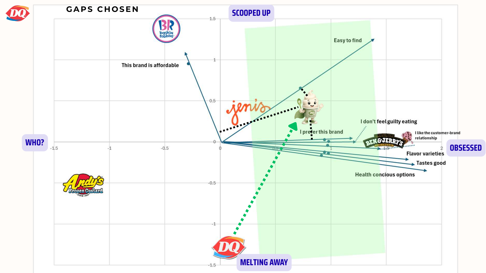
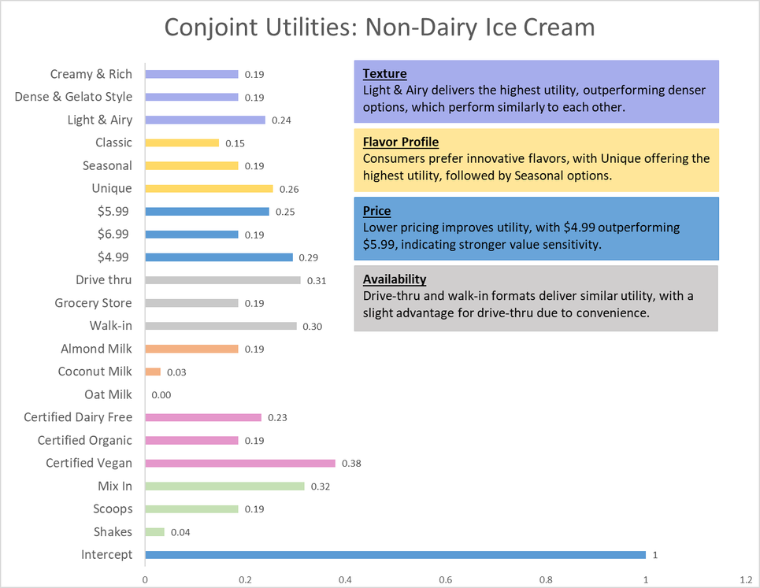

# Dairy Queen Dairy-Free Market Entry: Marketing Analytics Consulting Case Study

*A multi-method marketing-analytics study on whether, and how, Dairy Queen should enter the dairy-free frozen dessert category.*

**Methods:** Perceptual Mapping · Conjoint Analysis · Value Curve & Kano Model · Structured Problem Framing · Survey Design

> **Key outcome:** Two independent quantitative studies converged on the same answer: launch a **$4.99 oat-milk dairy-free Blizzard through DQ's existing 4,200+ walk-in locations.** In the conjoint model, DQ's optimal configuration scored the highest total preference utility (1.065) of any brand in the set, and perceptual mapping showed exactly why DQ needs to move, since it currently sits in the low-consideration, under-differentiated quadrant.
> **Presentation:** [Dairy-Free Go-to-Market Deck](reports/DQ_dairy_free_deck.pdf) — market sizing, buyer persona, positioning, and final recommendation.

---

## Executive Summary

Dairy Queen faces a category shift: consumers are moving toward plant-based and non-dairy desserts (driven by lactose intolerance, health, and ethics), while DQ has been losing ground with 42 store closures and flat unit volume. This project used four complementary analytical methods to decide **whether DQ should enter the dairy-free category, and if so, with what product, at what price, and through which channel**, grounding the recommendation in data rather than intuition.

The conclusion is specific and defensible: **price at $4.99, lead with indulgence, build on an oat-milk base, and sell it where DQ already wins, the walk-in.**

---

## My Role

I led this five-person team over a roughly three-month engagement, from problem framing and survey design through analysis and the final recommendation. I owned the quantitative core of the study:

- **Led the Conjoint Analysis end to end:** study design, the L18 orthogonal profile set, feature-importance decomposition, part-worth utility estimation, and the total-preference-utility model that identified the winning SKU.
- **Co-led the Value Curve and Kano findings:** analyzed the primary research on competitive positioning to separate satisfaction drivers from table-stakes.
- **Coordinated the team across all four methods** (perceptual mapping, conjoint, value curve, and structured problem framing), so I can speak to any part of the project in depth.

---

## Business Problem

**Management decision problem:** Should Dairy Queen enter the dairy-free frozen dessert category, and how should the product be configured and positioned?

**Research questions:**
1. Where does DQ sit in consumers' minds relative to direct competitors? *(Perceptual Mapping)*
2. Which product attributes actually drive purchase, and at what levels? *(Conjoint Analysis)*
3. Which attributes create satisfaction and differentiation vs. table-stakes? *(Value Curve & Kano)*
4. What are the concrete consumer pain points the category fails to solve? *(Structured Problem Framing)*
5. Given all of the above, what is the optimal SKU and go-to-market configuration?

### Why now: category signals

| Signal | Value | Implication |
|---|---|---|
| Lactose intolerant (U.S.) | ~36% (~120M people) | Large unaddressed base |
| Avoid or limit dairy | 41% | Demand beyond medical need |
| Dairy-free ice cream market | $2.65B | Material revenue pool |
| Category growth (CAGR) | 15.3% | Fast-expanding, early enough to win |
| DQ store closures | 42 | Brand under pressure |
| DQ average unit volume | ~$1.165M (flat) | Needs a growth catalyst |

---

## Methods

**1. Perceptual Mapping.** n = 52, 5 brands across 8 attributes. Positioned DQ against Jeni's, Ben & Jerry's, Baskin-Robbins, and Andy's to reveal where DQ sits in consumers' minds.



**2. Conjoint Analysis.** n = 50, 7 attributes across 3 levels, L18 orthogonal design. Decomposed the relative importance of each attribute and estimated part-worth utilities to identify the exact configuration that maximizes purchase preference.



**3. Value Curve & Kano Model.** Survey of Millennial and Gen Z consumers in urban U.S. markets. Mapped which attributes drive satisfaction and differentiation versus which are table-stakes.

**4. Structured Problem Framing (PLCN).** Developed 40 consumer pain points across 7 categories (taste, price, accessibility, certification, brand loyalty, and others) to ground the analysis in real category frustrations.

---

## Key Findings

- **DQ is poorly positioned today.** On the perceptual map, DQ clusters near the origin in the low-consideration, under-differentiated region while competitors own the high-affinity space.
- **Price is the #1 purchase driver.** Feature-importance decomposition: Price **21.97%**, Availability **20.62%**, Type of Ice Cream **19.41%**; certification (6.87%) and social-cause messaging (1.35%) barely move buyers.
- **The winning product is specific.** Top part-worth utilities: **$4.99 price (0.221)**, indulgent flavor (0.183), oat-milk base (0.183), walk-in purchase (0.166).
- **A correctly configured DQ wins the category.** Modeled total preference utility: **DQ optimal = 1.065**, beating Jeni's (0.856), Andy's (0.828), Ben & Jerry's (0.796), and Baskin-Robbins (0.743).
- **Demand intent is real.** 91.8% say environmental, health, or ethical factors influence food choices at least occasionally; ~80% would switch to or consider dairy-free; ~55% would pay the same or only $1 more.
- **The gap to close is customization.** Per the Value Curve and Kano analysis, DQ leads on affordability and flavor but under-delivers on personalization.

---

## Recommendation

Launch a **dairy-free Blizzard at a $4.99 entry price on an oat-milk base**, distributed through DQ's existing **4,200+ walk-in locations**. Lead marketing with indulgence and flavor (not certification or cause messaging, which don't move buyers), and address the customization gap to differentiate. The recommendation is both defensive (protect share from more progressive rivals) and offensive (capture a $2.65B, 15.3%-CAGR category early).

---

## Repository Contents

```
dairy-queen-marketing-analytics/
├── README.md
├── reports/
│   ├── dairy_free_final_report.pdf    # combined study: perceptual mapping + conjoint + recommendation
│   ├── conjoint_analysis.pdf
│   ├── value_curve_kano.pdf
│   └── problem_framing_plcn.pdf
│   ├── DQ_dairy_free_deck.pdf         # full go-to-market presentation (persona, positioning, recommendation)
└── charts/
    ├── perceptual_map.png       # brand biplot vs. purchase-driver attributes
    ├── conjoint_utilities.png   # part-worth utilities by attribute level
    └── market_share.png         # category share across the 5 brands
```

---

## Skills Demonstrated

Conjoint Analysis · Perceptual Mapping · Value Curve & Kano Modeling · Survey Design & Analysis · Feature-Importance Decomposition · Market Sizing · Competitive Positioning · Pricing Strategy · Data-Driven Recommendation · Team Leadership · Executive Communication · Buyer Persona / ICP Development · Go-to-Market Strategy · Presentation & Storytelling

---

## Team & Attribution

Group 6, MKT 534 (Analytical Tools for Marketers), Kellstadt Graduate School of Business, DePaul University. Instructor: Dr. Zafar Iqbal, 2026. Three-month team engagement.

Team: Haydar Temirlioglu, Anirudh Siddheswaran, Natalia Salamon, **Naveen Raj Kanagaraj (team lead)**, Elizabeth Chenier.
